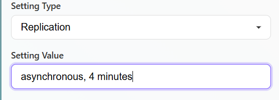

The changes made are as follows:
1) The create system doesn't have an option to enter the system name, it is set to the port number by default
2) The select system is normally being updated in all dropdowns on loading the window
3) The log.txt file was global earlier, it has been moved into the data_instance_portno. folder
4) The settings panel can be used to create the settings. For replication settings, the target system needs to be selected,
For asynchronous replication , the frequency of replication can be set as a value 
5) The setting can then be applied to the volume 
6) Multiple replication and snapshot settings are supported
7) Export-unexport function has been fixed