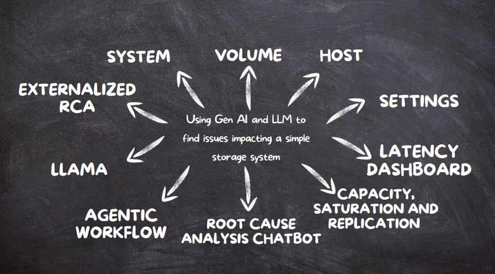

<h1 align="center">DiagnoSys Bot : Storage System AI Diagnostic Agent</h1>



DiagnoSys Bot is an AI-powered diagnostic assistant that helps users identify, analyze, and troubleshoot latency issues in storage systems by intelligently inspecting metrics, logs, and configurations. Designed for modern, complex storage infrastructures, this agent integrates large language models (LLMs), retrieval-augmented generation (RAG), and interactive visualizations to accelerate issue resolution.

## Features

- **LLM-Powered Diagnosis**: Uses the Groq LLM API to intelligently process user queries and orchestrate tool invocations for gathering relevant diagnostic data.
- **Tool-Based Analysis**: Leverages specialized tool wrappers to fetch and process system metrics, logs, and configuration details relevant to the suspected issue.
- **RAG Integration**: Integrates support documentation (PDF/text) to supplement AI-generated recommendations with reference content from manuals, KB articles, and internal documentation.
- **Interactive Visualizations**: Displays key diagnostic metrics via interactive charts and dashboards for clear, real-time insights.
- **Conversational Context Tracking**: Maintains context of the diagnostic session across multiple user queries to support deep-dive, follow-up, and comparative analysis.

## Supported Latency Issue Types

DiagnoSys Bot agent currently supports diagnosis of three primary latency fault categories in storage systems:

1. **High Capacity Usage Issues**
   - Detects when elevated storage capacity consumption leads to degraded I/O latency.
   - Monitors capacity thresholds, volume sizes, and historical usage patterns.

2. **High Throughput Saturation Issues**
   - Identifies scenarios where storage arrays or servers become saturated with I/O requests, causing queueing delays.
   - Analyzes IOPS, bandwidth utilization, queue depths, and average response times.

3. **Replication Link Issues**
   - Diagnoses problems in replication networks that might cause delayed writes, asynchronous lag, or inconsistent states.
   - Tracks replication link health, transfer rates, and lag metrics.
  
## Tech Stacks used
- Python and Flask(Backend)
- HTML,CSS,JavaScript(Frontend)
- LLM(LLaMA-3.3-70B-Versatile)- using Groq’s LLM API
- RAG and FAISS Vector Store-for retrieving and storing rca chunks from the rca document(rag.txt)
- Langchain for agentic workflow
- Streamlit for RCA chatbot for the storage system

## Setup Instructions

### Prerequisites

- Python 3.8+
- Groq API Key 
- Streamlit (for interactive web UI)

### Installation

1. Clone this repository:

   ```bash
   git clone https://github.com/Dhanush-M555/DiagnoSys
   cd DiagnoSys
   ```

2. Install Python dependencies:

   ```bash
   pip install -r requirements.txt
   ```

## Running the Agent

To start the Streamlit web application, run:

```bash
streamlit run agent.py
```

Once the app launches, open your browser and navigate to:

[http://localhost:8501](http://localhost:8501)

## Usage Instructions

1. **Select a Storage System**  
   Use the storage subsystem UI to create systems and export/unexport volumes.

2. **Enter a Query**  
   In the text input area, type a natural language query about system performance or a specific latency event.  
   _Example:_  
   `"Why is volume1 in system 5003 experiencing high latency?`

3. **Review the AI's Analysis**  
   The agent will:
   - Fetch relevant metrics and logs.
   - Perform AI-based analysis.
   - Summarize possible causes, issue classifications, and offer documentation snippets for reference.

5. **Ask Follow-up Questions**  
   Continue the session by typing new, related queries to dive deeper into metrics or request targeted suggestions.  
   _Example:_  
   `"Is system 5003 experiencing any replication issues currently?"`

## Visualizations

Streamlit-powered interactive dashboards visualize:

- Line and bar charts for capacity, latency, IOPS, and throughput over time.

## Development & Extensibility

**To extend diagnostic capabilities:**

1. **Add New Tool Functions**  
   Create additional data retrieval and analysis functions.

2. **Update Documentation Corpus**  
   Add new text files containing operational manuals, KB articles, or troubleshooting guides into the project root.

3. **Enhance Visualizations**  
   Update the Streamlit app (`agent.py`) to visualize new metrics or analysis results.

## Documentation Index

For detailed instructions, examples, and component overviews, refer to:

- [Project Overview](https://github.com/Dhanush-M555/HPE_GenAI/tree/main/README.md)

- [Fault Simulation Guide and Demo](https://github.com/Dhanush-M555/HPE_GenAI/tree/main/demo/README.md)

- [Overview of Core Utilities and Storage File Formats used](https://github.com/Dhanush-M555/HPE_GenAI/tree/main/utils/README.md)

- [UI Details & Walkthrough Screenshots](https://github.com/Dhanush-M555/HPE_GenAI/tree/main/ui/README.md)

- [Overview of Problem Spaces](https://github.com/Dhanush-M555/HPE_GenAI/tree/main/problem_spaces/README.md)

- [Test Case Configurations](https://github.com/Dhanush-M555/HPE_GenAI/tree/main/demo/testcases.txt)

- [LLM Agentic Workflow Insights](https://github.com/Dhanush-M555/HPE_GenAI/tree/main/workflow/README.md)

For step-by-step fault reproduction, UI screenshots, and simulated environment setup, consult the relevant guides above.

## License

This project is licensed under the **MIT License**. See the [LICENSE](LICENSE) file for details.
