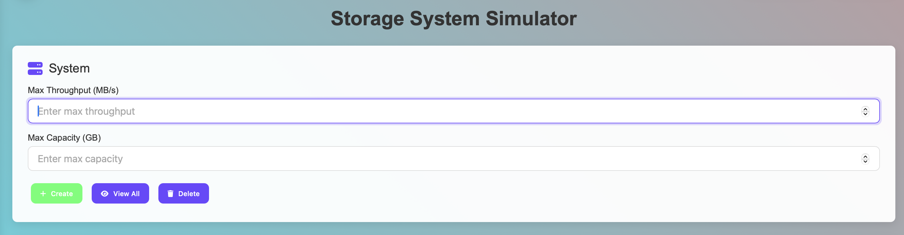
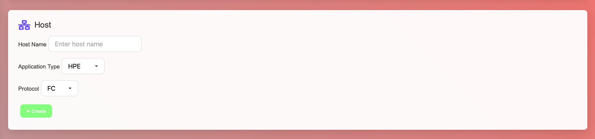
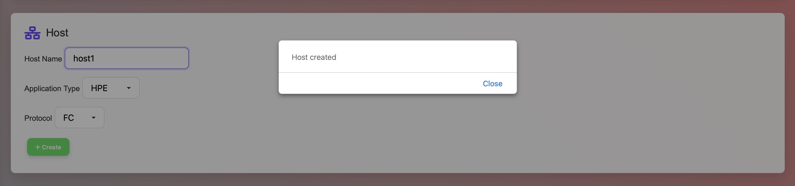
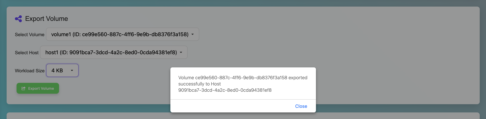
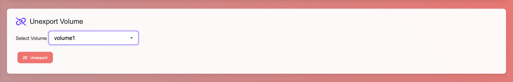
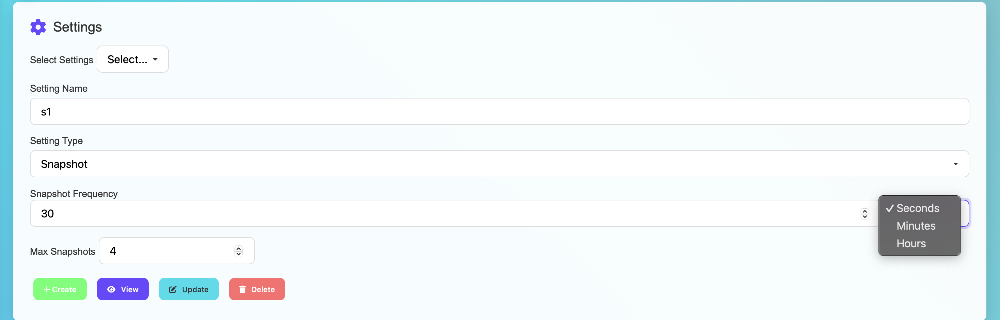

### Storage System Simulator

The **Storage System Simulator** is an intuitive and interactive web-based tool designed to simulate the working of storage systems efficiently. 

### System Object

The first core entity in this simulator is the **System** object, which allows users to specify key performance parameters including 
**Max Throughput (in MB/s)** and **Max Capacity (in GB)**. 
With a sleek user interface, users can easily create new systems, view all configured systems, or delete them as needed. 

On successfully creating a system, the following response will be displayed with port number assigned to the system along with a unique ID using the following python function: **str(uuid.uuid4())**, which ensures that no two UUID's collide across systems.

The storage system handles duplicate system creation efficiently by displaying the following error when user tries to create a system in the same instance. 

The view all button displays all systems created under the current instance along with their attributes(max capacity,max throughput and name) as shown below. There are also update and delete functionalities that allow users to alter the attribute values or delete the system permanently. 

### Volume Object

The **Volume** object represents an individual storage unit that can be created within a specific system in the Storage System Simulator. Each volume requires a unique **Volume Name**, a defined **Volume Size (in GB)**, and an association with an existing setting through the **Select Volume** dropdown. This feature allows users to simulate multiple volumes within storage systems, enabling better testing and modeling of storage allocation scenarios like system utilization.

Shown below is the response for successful creation of a volume, along with settings(to be applied as of the picture) and other attributes. 

Similar to systems, volumes are also associated with a UUID, generated using the same python function **str(uuid.uuid4())**, and also have CRUD fucntionalities, as shown in the UI. Specifics of the Settings object and its types will be detailed further below.

### Host Object

The **Host** object in the Storage System Simulator represents a computing entity that connects to storage resources. Each host is defined by a unique **Host Name**, an **Application Type** (e.g., HPE, VMware, Oracle,SQL), and a **Protocol** (e.g., FC - Fibre Channel, iSCSI,NVMe). This setup allows users to simulate real-world host configurations and their interaction with storage volumes. 

On successful creation of host, the following dialog box is displayed

### Export Volume

The **Export Volume** feature links a defined volume to a specific host, simulating the process of exposing storage to computing resources in real-world storage systems. Users can select a configured **Volume** and **Host**, then specify a **Workload Size** (e.g., 4 KB to 128 KB) to simulate different I/O block sizes for performance modeling. This enables realistic testing of how various hosts interact with volumes under different data loads. The feature is essential for evaluating storage behavior, workload planning, and system validation in simulated environments.

On succesful export,the following dialog box appears:

### Unexport Volume

The **Unexport Volume** functionality allows users to detach or revoke access of a previously exported volume from a host. By selecting the target **Volume** from the dropdown, users can easily remove its association with any host, effectively simulating the process of unmapping storage in real-world SAN or NAS environments. This action is essential for lifecycle management, allowing for the reallocation of storage resources, cleanup of test configurations, or security isolation. The clean interface ensures safe and controlled unexport operations with a single click.

### Settings Object

The **Settings** module in the Storage System Simulator enables users to define and manage system behaviors such as **Snapshot** policies and **Replication** policies. 

### Snapshot Settings

The **Snapshot Settings** module enables users to define automated snapshot policies for data protection and recovery simulation. Each setting is composed of a unique **Setting Name**, a **Setting Type** (set to `Snapshot`), a configurable **Snapshot Frequency** (custom interval and unit such as minutes, hours, or days), and a defined limit for **Max Snapshots** to control resource usage.
This feature empowers users to simulate real-world snapshot scheduling strategies, analyze system behavior under frequent data capture scenarios, and ensure efficient space management. 

### Replication Settings

The **Replication Settings** section in the Storage System Simulator allows users to configure data replication policies between storage systems, simulating real-world disaster recovery and high-availability scenarios. Users begin by assigning a unique **Setting Name** and selecting the **Setting Type** as `Replication`. The **Replication Type** can be set to either `Synchronous` (real-time mirroring) or `Asynchronous` (delayed replication), depending on the performance and consistency requirements of the environment.
A configurable **Delay (in seconds)** is available for asynchronous setups to simulate network lag or scheduled transfer intervals. The **Target System** dropdown lets users choose a destination system for the replication, enabling simulation of cross-system data redundancy or geo-distributed architecture. 

With options to **Create**, **View**, **Update**, or **Delete** settings, this feature empowers users to model robust data replication strategies and test their effectiveness within the simulator.

### ⏱️ Latency Monitoring Dashboard

The **Latency Monitoring Dashboard** provides real-time insight into system performance by tracking and visualizing I/O latency across volumes. The **Top 5 Volumes by Latency (Last 15 Min)** table ranks exported volumes based on their average response time, helping users quickly identify performance bottlenecks. Each entry includes the **Volume Name**, associated **Host**, and **Average Latency (in ms)** over the past 15 minutes.

Below the ranking table, a dynamic line chart illustrates **Latency Trends** for individual volumes, capturing fluctuations in latency values over the monitored period. This visualization allows users to evaluate the consistency of I/O performance and assess the impact of workloads or policies applied to volumes in the simulator.

Together, these components provide an effective performance monitoring tool for testing storage configurations under load in simulated environments.

### System Logs: Local vs Global

The **System Logs** module provides visibility into system activities, helping users trace operations such as snapshot cleanup, system creation, deletions, and errors.

#### Local Logs
- **Scope:** Logs specific to the local simulation environment or a particular instance/volume.
- **Purpose:** Ideal for debugging operations tied to a specific volume, snapshot process, or system behavior.
- **Examples:** Deletion of snapshots, snapshot cleanup routines, and volume-specific storage capacity changes.

#### Global Logs
- **Scope:** Logs that encompass the entire simulation platform or multiple components across the environment.
- **Purpose:** Useful for understanding system-wide behavior, lifecycle events, and global policies in effect.
- **Examples:** System creation or deletion attempts, fault injection events, warnings on duplicate actions (e.g., trying to create a system that already exists).

#### Features
- **Real-Time Log Display:** The log console updates in real time to reflect system actions.
- **Log Filtering:** Users can toggle between `Local Logs` and `Global Logs` for targeted analysis.

This logging system ensures transparency, helping users simulate, observe, and validate storage system behaviors under varying workloads and policies.

### Replication Link Fault Injection

The **Replication Link Fault Injection** tool enables simulation of network faults or delays on synchronous replication links between storage systems. 

#### Configuration Options

- **Select System Link:**
  - Dropdown list of systems with **synchronously replicated volumes**.
  - Only eligible links are shown to prevent injection on non-replicated or asynchronously replicated systems.

- **Sleep Time (ms):**
  - Specifies the **artificial delay** (in milliseconds) to be introduced in replication operations.

- **Fault Duration (seconds):**
  - Defines how long the fault should persist.
  - A value of `0` implies a **permanent fault**—lasting until the replication volume is unexported or manually cleared.
  - Any positive integer sets a temporary fault duration, useful for short-lived simulations or automated recovery tests.

#### Actions

- **Inject Fault (Red Button):**
  - Applies the defined fault settings to the selected system.
  - Triggers logs and visual indicators to reflect performance impact.

- **Cancel (Purple Button):**
  - Clears the current configuration and exits fault injection mode without making changes.

#### Use Case Scenarios

- **Performance Testing:** Evaluate how the system behaves under increased latency during replication.

### JSON data

The NavBar lets you toggle between and view JSON data for all the objects(i.e, System, Volume, Settings and Host) as shown below. 

