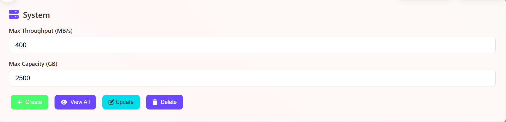
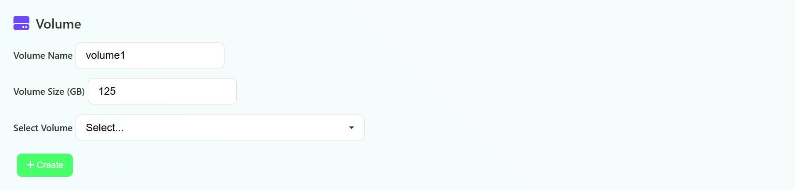
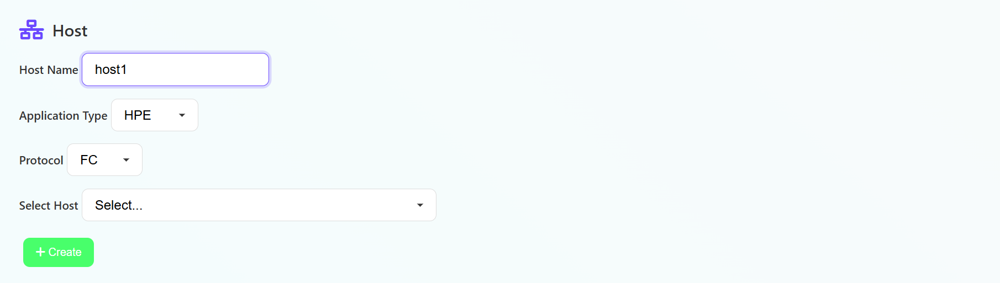
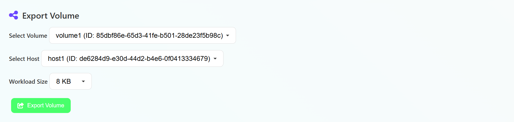
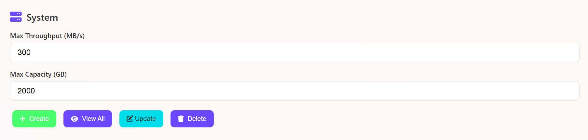
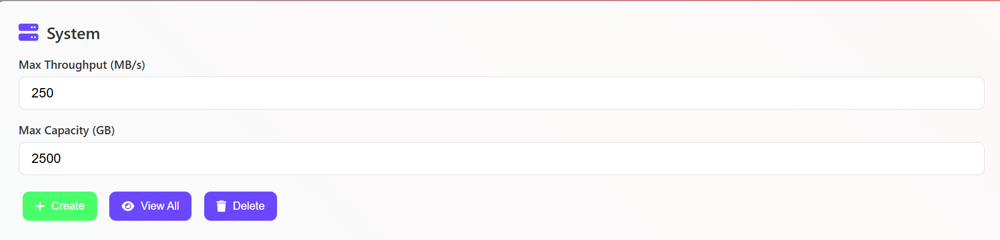
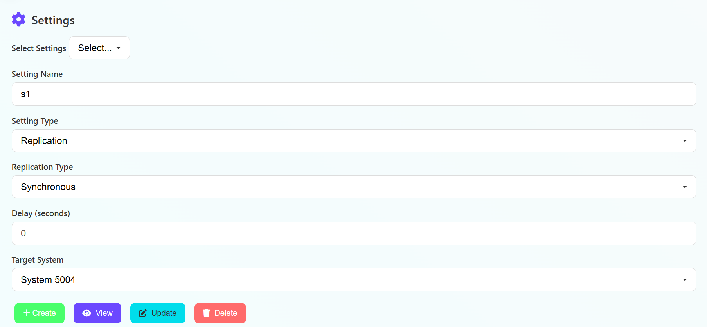
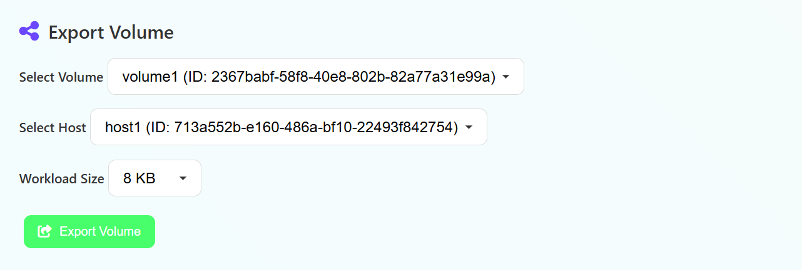
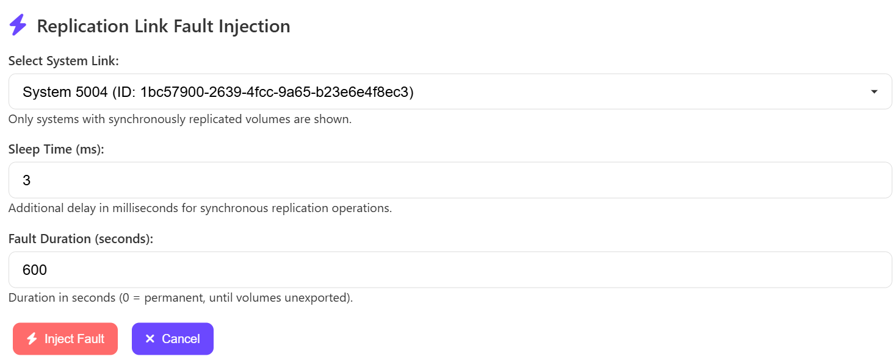

<h1 align="center">End-to-End Fault Simulation & LLM Diagnosis Guide</h1>

This guide walks you through simulating three real-world storage system fault scenarios from scratch using the codebase in this repository. You will:
- Set up storage systems, volumes, hosts, snapshots, and replication links
- Inject faults (saturation, snapshot overload, replication delay)
- Use the LLM-powered agent to analyze and diagnose each scenario

---

## Prerequisites
- Python 3.8+
- All dependencies installed (`pip install -r requirements.txt`)
- (Optional) Streamlit for the LLM UI: `pip install streamlit`

---
<h2 align="center">Fault Simulation Demo Guide (UI-Only)</h2>

This guide shows you how to simulate storage system faults using **only the web UI** (Streamlit app). You do not need to run any Python code directly—just follow the steps in your browser!

---

## Scenario 1: High Latency Due to High System Saturation

### 1. Launch the Streamlit UI

Open a terminal in your project directory and run:
```bash
streamlit run agent.py
```
This will launch the web UI. Open your browser and go to [http://localhost:8501](http://localhost:8501).

---

### 2. Run app.py for System 5001
- Open a new terminal in your project directory.
- Run the following command in a new terminal:
  ```bash
  python app.py --port 5001
  ```

---

### 3. Create the Storage System and Resources

**In the UI, perform the following actions:**

#### a. Create a New Storage System
- Use the UI controls to create a new system with:
  - **System Name:** System 5001
  - **Max Throughput:** 400 MB/s
  - **Max Capacity:** 2500 GB



#### b. Add Volumes
- Add three volumes to System 5001:
  - **Volume1:** 125 GB
  - **Volume2:** 200 GB
  - **Volume3:** 150 GB



#### c. Add Hosts
- Add three hosts:
  - **Host1**
  - **Host2**
  - **Host3**



#### d. Export Volumes to Hosts with Workload
- Export each volume to a host with the following settings:
  - **Volume1 → Host1:** Workload size = 8 KB, IOPS = 2000
  - **Volume2 → Host2:** Workload size = 32 KB, IOPS = 2000
  - **Volume3 → Host3:** Workload size = 128 KB, IOPS = 2000

  *(If the UI does not have fields for workload size and IOPS, set these values as close as possible to the above.)*



---

### 4. Let the System Run
- **Wait 1-2 minutes** to allow the system to generate metrics and simulate the workload.Monitor the top average volume latencies for an increase in latency. 


---


### 5. Simulate the Fault and Analyze with LLM
- In the chat input of the UI, enter the following prompt:
  ```
  Why is volume v3 in System 5001 experiencing high latency?
  ```
- Submit the prompt.

---

### 6. Review the LLM's Diagnosis
- The LLM will analyze the current system state and return a detailed fault report.
- You should see a diagnosis indicating **high system saturation** as the root cause, with recommendations for remediation.

---

## Scenario 2: High Latency Due to High System Capacity (Snapshot Overload)

### 1. Launch the Streamlit UI

If you haven't already, open a terminal in your project directory and run:
```bash
streamlit run agent.py
```
Open your browser and go to [http://localhost:8501](http://localhost:8501).

---

### 2. Run app.py for System 5002
- Open a new terminal in your project directory.
- Run the following command in a new terminal:
  ```bash
  python app.py --port 5002
  ```
---

### 3. Create the Storage System and Resources

**In the UI, perform the following actions:**

#### a. Create a New Storage System
- Use the UI controls to create a new system with:
  - **System Name:** System 5002
  - **Max Throughput:** 300 MB/s
  - **Max Capacity:** 2000 GB



#### b. Add Volumes (with Snapshot Settings)
- Add three volumes to System 5002:
  - **Volume1:** 50 GB, with snapshot settings: max_snapshots = 15, frequency = 5 seconds
  - **Volume2:** 300 GB, with snapshot settings: max_snapshots = 1, frequency = 60 seconds
  - **Volume3:** 100 GB, with snapshot settings: max_snapshots = 2, frequency = 30 seconds

  *(If the UI allows, set these snapshot settings when creating the volumes. If not, edit the volume after creation to add snapshot settings.)*


#### c. Add Hosts
- Add two hosts:
  - **Host1**
  - **Host2**

#### d. Export Volumes to Hosts with Workload
- Export each volume to a host with the following settings:
  - **Volume1 → Host1:** Workload size = 32 KB, IOPS = 2000
  - **Volume2 → Host2:** Workload size = 8 KB, IOPS = 2000
  - **Volume3 → Host1:** Workload size = 4 KB, IOPS = 2000


  *(If the UI does not have fields for workload size and IOPS, set these values as close as possible to the above.)*

#### e. Start Snapshots
- For each volume, start snapshots with the specified frequency (if not already running):
  - **Volume1:** every 5 seconds
  - **Volume2:** every 60 seconds
  - **Volume3:** every 30 seconds

  *(Use the UI controls to start or configure snapshots for each volume as needed.)*

---

### 4. Let the System Run
- **Wait a few minutes** to allow snapshots and metrics to accumulate and simulate the overload.Monitor the top average volume latencies for an increase in latency. 

---

### 5. Simulate the Fault and Analyze with LLM
- In the chat input of the UI, enter the following prompt:
  ```
  Why is volume v1 in System 5002 experiencing high latency?
  ```
- Submit the prompt.

---

### 6. Review the LLM's Diagnosis
- The LLM will analyze the current system state and return a detailed fault report.
- You should see a diagnosis indicating **high system capacity (snapshot overload)** as the root cause, with recommendations for remediation.

---

## Scenario 3: High Latency Due to Replication Link Issues

### 1. Launch the Streamlit UI

If you haven't already, open a terminal in your project directory and run:
```bash
streamlit run agent.py
```
Open your browser and go to [http://localhost:8501](http://localhost:8501).

---

### 2. Run app.py for System 5003 and System 5004
- Open a new terminal in your project directory.
- Run the following commands:
  ```bash
  python app.py --port 5003
  python app.py --port 5004
  ```
  Run the above command in seperate terminals,one for each system.


---

### 3. Create the Source and Target Storage Systems

**In the UI, perform the following actions:**

#### a. Create the Source System
- Use the UI controls to create a new system with:
  - **System Name:** System 5003
  - **Max Throughput:** 350 MB/s
  - **Max Capacity:** 1500 GB


#### b. Create the Target System
- Use the UI controls to create another system with:
  - **System Name:** System 5004
  - **Max Throughput:** 250 MB/s
  - **Max Capacity:** 2500 GB



#### c. Add Volume to Source System (with Replication Settings)
- Add a volume to System 5003:
  - **Volume1:** 100 GB
  - **Replication Settings:**
    - Replication type: Synchronous
    - Replication target: System 5004



#### d. Add Host to Source System
- Add a host:
  - **Host1**


#### e. Export Volume to Host
- Export **Volume1** to **Host1** with:
  - Workload size = 8 KB, IOPS = 2000


#### f. Inject Replication Fault
- Use the UI's replication fault injection feature to:
  - Set a delay of **3 ms** for the replication link between System 5003 and System 5004.
  - Set the fault duration to **600 seconds** (10 minutes).




---

### 4. Let the System Run
- **Wait a few minutes** to allow metrics and replication events to accumulate and simulate the fault.Monitor the system logs in the UI.


---

### 5. Simulate the Fault and Analyze with LLM
- In the chat input of the UI, enter the following prompt:
  ```
  Why is volume v1 in System 5003 experiencing high latency?
  ```
- Submit the prompt.

---

### 6. Review the LLM's Diagnosis
- The LLM will analyze the current system state and return a detailed fault report.
- You should see a diagnosis indicating **replication link issues** as the root cause, with recommendations for remediation.

---

## Troubleshooting
- If you do not see the expected options in the UI, ensure you are using the latest version of the code and that all dependencies are installed.
- If the systems, volumes, replication, or fault injection options do not appear, refresh the UI or restart the Streamlit app.

**You have now simulated the third fault scenario using only the UI!**

---

## Notes
- You can adjust parameters (sizes, workload, snapshot frequency, fault duration) to create custom scenarios.
- For each scenario, the LLM agent will analyze the current state and provide a root cause report and recommendations.
- For more details, see testcases.txt and the main README. 
