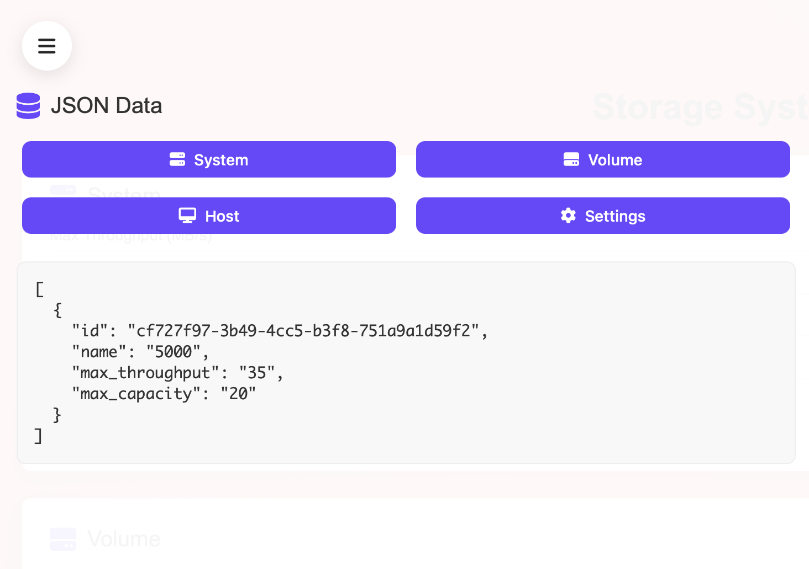
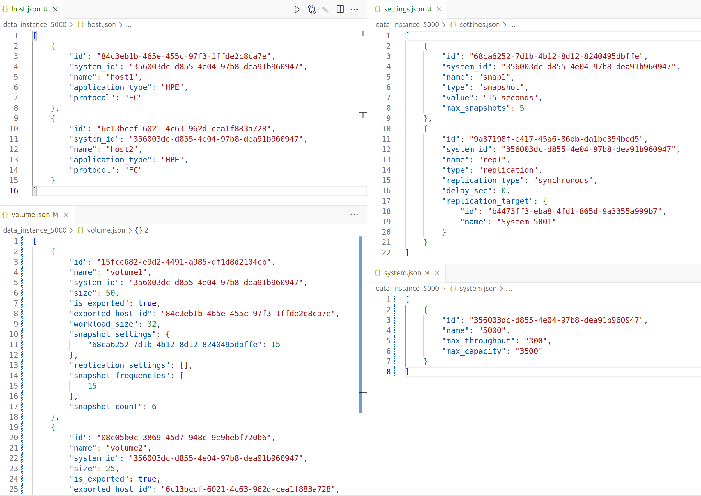
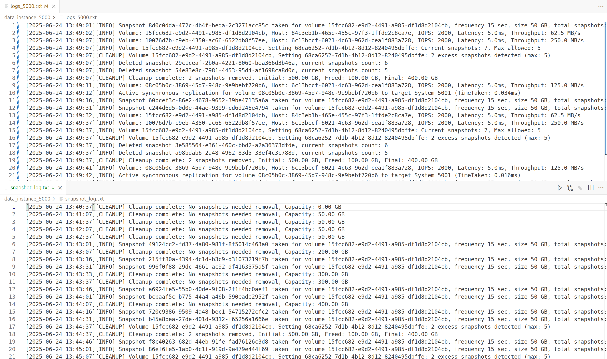

<h1 align="center">Utilities Overview </h1>

This folder contains the core utility modules that power the backend logic and infrastructure of the Storage System Simulator project. These modules are designed for reusability, modularity, and clarity, ensuring that the main application code remains clean and maintainable.

## Modules Included

- **storage.py** — Storage management logic and data persistence.
- **models.py** — Data models and schema definitions.
- **logger.py** — Logging utilities for local and global logs.
- **clear.py** — Utility for cleaning up generated files and folders.

## How to Use

To leverage these utilities in your code, import them as follows:

```python
from utils.storage import StorageManager
from utils.models import System, Volume
from utils.logger import Logger
```

## Contribution Guidelines

- Write utility functions and classes to be as generic and reusable as possible.
- Document all public functions and classes clearly.
- Add tests for new utilities if possible to ensure reliability.

---
<h1 align="center">Storage System File Structure : Configuration, Metrics, and Logs </h1>

When you create a new storage system, the simulator generates several files grouped into three main categories: **Configuration Files**, **Metric Files**, and **Log Files**. Each category serves a distinct purpose in managing, monitoring, and troubleshooting your simulated environment.

---

### 1. Configuration Files

**Purpose:**  
Configuration files store the core definitions and relationships of your storage system, including systems, volumes, hosts, and settings. These files represent the current state and structure of your environment.

**Files Included:**
- `system.json` – Contains metadata for each storage system (ID, name, max throughput, max capacity).
- `volume.json` – Lists all volumes, their attributes, and associations with systems and hosts.
- `host.json` – Details all hosts, including their application type and protocol.
- `settings.json` – Stores snapshot and replication policy definitions.
- `snapshots.json` – Tracks all snapshots created for volumes.
- `global_systems.json` - Keep record of all storage systems.

**How to View:**  
The NavBar lets you toggle between and view JSON data for all the objects(i.e, System, Volume, Settings and Host) as shown below. 



**Example:**  


---

### 2. Metric Files

**Purpose:**  
Metric files capture real-time and historical performance data, enabling you to monitor system health, resource usage, and workload characteristics.

**Files Included:**
- `io_metrics.json` – Logs I/O statistics for each volume (IOPS, latency, throughput).
- `system_metrics.json` – Records system-wide metrics like throughput used, capacity used, CPU usage, and latency.
- `replication_metrics.json` – Tracks metrics related to replication activities.

**Example** 


---

### 3. Log Files

**Purpose:**  
Log files provide a chronological record of system events, operations, and cleanup activities. They are essential for debugging, auditing, and understanding system behavior over time.

**Files Included:**
- `logs_<system_name>.txt` – Contains global and local logs for the system, including I/O events and system actions.
- `snapshot_log.txt` – Specifically logs snapshot cleanup operations and related capacity changes.

**Example:**  



---

By understanding these file categories and their roles, you can better manage, monitor, and troubleshoot your simulated storage systems. 