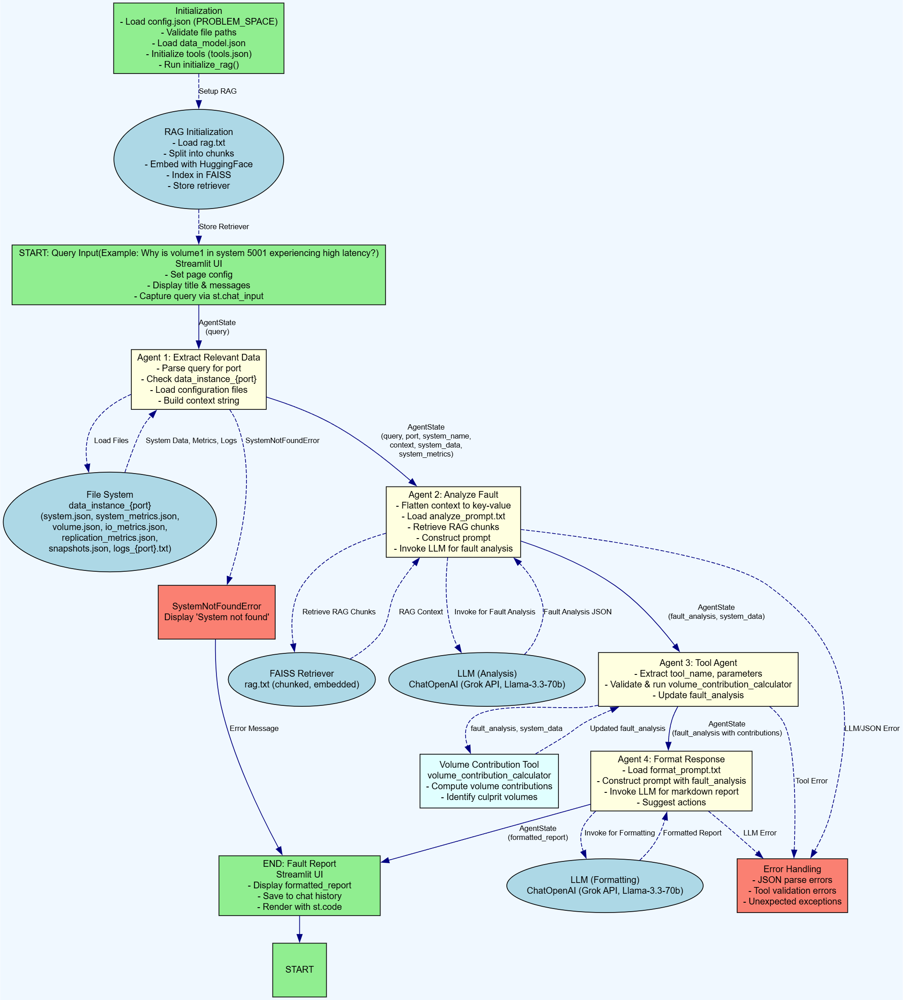

<h1 align="center">Overview of Agentic Workflow</h1>

The `agent.py` script implements DiagnoSys Bot, a Root Cause Analysis (RCA) chatbot for analyzing faults in storage systems. It leverages a Large Language Model (LLM) to process system data, perform fault analysis, and generate human-readable reports. The LLM is integrated with LangChain for prompt engineering, LangGraph for agent orchestration, and Streamlit for the user interface. This document details the LLM's role, the specific model used, its configuration, and the workflow.

## LLM Details
### Model Used
- **Model**: LLaMA-3.3-70B-Versatile
- **Provider**: Groq
- **API Endpoint**: `https://api.groq.com/openai/v1`
- **API Key**: `` (hardcoded in the script)
- **Characteristics**:
  - A 70-billion parameter model optimized for versatility in natural language tasks.
  - Fine-tuned for JSON-structured outputs and conversational tasks.
  - Accessed via Groq's API, which wraps the model in an OpenAI-compatible interface.

### Configuration
The LLM is initialized using LangChain's `ChatOpenAI` class with the following settings:
```python
llm = ChatOpenAI(
    model=GROQ_MODEL,  # "llama-3.3-70b-versatile"
    openai_api_base="https://api.groq.com/openai/v1",
    openai_api_key=GROQ_API_KEY,
    temperature=0
)
```
- **Model Name**: `llama-3.3-70b-versatile`
- **API Base**: Points to Groq's API endpoint for compatibility with OpenAI's API structure.
- **API Key**: Authenticates requests to the Groq API.
- **Temperature**: Set to `0` for deterministic, precise outputs (crucial for JSON parsing and structured fault analysis).

### Dependencies
- **LangChain**: Provides `ChatOpenAI`, `SystemMessage`, and `HumanMessage` for prompt construction and LLM invocation.
- **Groq API**: Facilitates access to the LLaMA model via xAI's infrastructure.
- **Python Libraries**: `json`, `os`, `re`, `importlib.util`, `typing`, `streamlit`.

## LLM Role in the DiagnoSys Bot
The LLM is used in two primary stages of the workflow:
1. **Fault Analysis (in `analyze_fault` agent)**:
   - Analyzes system data, metrics, and RAG (Retrieval-Augmented Generation) context to identify faults.
   - Generates a JSON-structured fault analysis with a `tool_call` for further processing.
2. **Response Formatting (in `format_response` agent)**:
   - Converts the JSON fault analysis into a human-readable report.
   - Incorporates RAG context and system metadata for clarity.

The LLM processes structured prompts to ensure consistent outputs, leveraging its natural language understanding to interpret system data and generate actionable insights.

## Agentic Workflow

The RCA chatbot processes user queries (e.g., "Why is volume1 in system 5002 experiencing high latency?") through a LangGraph-orchestrated workflow involving four agents: `extract_relevant_data`, `analyze_fault`, `tool_agent`, and `format_response`. The LLM is invoked in the `analyze_fault` and `format_response` agents. Below is a detailed explanation of the workflow.

### 1. Configuration and Initialization
- **Configuration Loading**:
  - Reads `config.json` to set `PROBLEM_SPACE` (default: `storage_system`).
  - Defines paths for problem space files (`data_model.json`, `tools.json`, `rag.txt`, `analyze_prompt.txt`, `format_prompt.txt`).
  - Validates file existence, raising `FileNotFoundError` if any are missing.
- **Data Model**:
  - Loads `data_model.json` to extract `fault_analysis_structure` (string-based JSON template, e.g., `{"fault_type": "No fault", "details": {}}`).
- **Tools**:
  - Loads `tools.json` to initialize tools (e.g., `volume_contribution_calculator.py`) using `importlib.util`.
- **RAG Initialization**:
  - Executes `initialize_rag()` once at startup to load and index `rag.txt`:
    ```python
    def initialize_rag():
        if "retriever" not in st.session_state:
            print("🔍 Loading and splitting RAG document...")
            loader = TextLoader(RAG_PATH)
            docs = loader.load()
            splitter = RecursiveCharacterTextSplitter(chunk_size=1000, chunk_overlap=100)
            chunks = splitter.split_documents(docs)
            print("📡 Embedding and indexing...")
            embeddings = HuggingFaceEmbeddings(model_name="sentence-transformers/all-MiniLM-L6-v2")
            vectorstore = FAISS.from_documents(chunks, embeddings)
            st.session_state.retriever = vectorstore.as_retriever(search_type="similarity", search_kwargs={"k": 7})
    ```
    - Uses `TextLoader` to load `rag.txt`.
    - Splits into chunks with `RecursiveCharacterTextSplitter`.
    - Embeds chunks using `HuggingFaceEmbeddings` (`all-MiniLM-L6-v2`).
    - Indexes in FAISS for similarity-based retrieval.
    - Stores retriever in `st.session_state.retriever` to avoid re-initialization.

### 2. Streamlit UI Setup
- **Initialization**:
  - Sets page configuration (`page_title`, `page_icon`, `layout="wide"`).
  - Displays title and description.
  - Adds a debug mode checkbox in the sidebar.
  - Initializes `st.session_state.messages` with a welcome message.
- **Chat History**:
  - Renders messages using `st.chat_message` and `st.code` (for formatted reports) or `st.markdown` (for other messages).
- **Query Input**:
  - Captures user queries via `st.chat_input`.
  - Appends queries to `st.session_state.messages` with `is_formatted=False`.

### 3. LangGraph Workflow
The workflow is defined using a `StateGraph` with `AgentState`:
```python
class AgentState(TypedDict):
    query: str
    port: int
    system_name: str
    context: str
    fault_analysis: Dict[str, Any]
    formatted_report: str
    system_data: Dict[str, Any]
    system_metrics: Dict[str, Any]
    rag_context: str
    skip_analysis: bool
```

#### Agent 1: `extract_relevant_data`
- **Purpose**: Extracts system data and metrics for the queried system (e.g., port 5002).
- **Process**:
  - Parses query to extract port number (default: 5000).
  - Checks for `data_instance_{port}` directory.
  - If missing:
    - Sets `fault_analysis = {"error": "System not found", "port": port}`.
    - Sets `skip_analysis = True`.
    - Returns state to skip analysis.
  - Loads data files (`system.json`, `system_metrics.json`, `volume.json`, etc.).
  - Builds `context` string with JSON dumps of data.
  - Updates `state` with `port`, `system_name`, `system_data`, `system_metrics`, and `context`.
- **Output**: Updated `state` with system data or error.

#### If the queried system does not exist:
 - In the `extract_relevant_data` agent, if the system data directory (`data_instance_{port}`) is not found, a `SystemNotFoundError` is raised:
    ```python
    if not os.path.exists(data_dir):
        raise SystemNotFoundError(f"System not found for port {port}")
    ```
  - This exception is caught in the `main` function of the Streamlit UI, where it triggers an error message ("System not found") to be displayed and stored in the chat history:
    ```python
    except SystemNotFoundError as e:
        error_message = "System not found"
        st.session_state.messages.append({"role": "assistant", "content": error_message})
        with st.chat_message("assistant"):
            st.markdown(error_message)
    ```
  - If no exception is raised, the workflow proceeds directly from `extract_data` to `analyze_fault` via the defined edge:
    ```python
    workflow.add_edge("extract_data", "analyze_fault")
    ```
  - This approach simplifies the workflow by handling system-not-found errors at the application level rather than within the LangGraph state management.

#### Agent 2: `analyze_fault`
- **Purpose**: Analyzes system data and RAG context to generate a JSON fault analysis.
- **LLM Usage**: Primary stage where the LLM is invoked.
- **Process**:
  - Skips if `fault_analysis` has an error.
  - Flattens `context` into key-value pairs using `flatten_json`.
  - Loads `analyze_prompt.txt`.
  - Retrieves RAG chunks using `st.session_state.retriever.invoke(query)`.
  - Constructs prompt:
    - **System Message**: Combines `analyze_prompt_content` (with `PROBLEM_SPACE` substitution) and RAG context.
    - **Human Message**: Includes query, flattened system data, and `fault_analysis_structure`.
  - Invokes LLM:
    ```python
    response = llm.invoke(messages)
    raw_response = response.content.strip()
    ```
  - Parses response:
    - Removes JSON code fences (`````json`, `````).
    - Attempts `json.loads(raw_response)`.
    - Validates required fields (`tool_call`, `tool_name`, `parameters`, etc.).
    - Handles errors (JSON parse or validation) by setting `fault_analysis` with error details.
  - Updates `state` with `fault_analysis` and `rag_context`.
- **Output**: `state` with JSON fault analysis, e.g.:
  ```
      {
      "fault_type": "High latency due to replication link issues",
      "details": {
        "latency": 4.0,
        "capacity_percentage": 6.666666666666667,
        "saturation": 4.464285714285714,
        "volume_capacity": 100.0,
        "snapshot_capacity": 0,
        "maximum_capacity": 1500,
        "maximum_throughput": 350,
        "volume_details": [
          {
            "volume_id": "bf5e323c-73cc-40e9-85d2-9af841de92bd",
            "name": "volume1",
            "size": 100,
            "snapshot_count": 0,
            "throughput": 15.625,
            "workload_size": 8
          }
        ],
        "replication_issues": [
          {
            "volume_id": "bf5e323c-73cc-40e9-85d2-9af841de92bd",
            "volume_name": "volume1",
            "target_id": "c65b3111-1903-424c-a9db-7f64fb4b0191",
            "target_system_name": "System 5004",
            "latency": 3.049,
            "timestamp": "2025-06-25 17:17:22"
          }
        ]
      },
      "tool_call": {
        "tool_name": "volume_contribution_calculator",
        "parameters": {
          "fault_analysis": {
            "fault_type": "High latency due to replication link issues",
            "details": {
              "latency": 4.0,
              "capacity_percentage": 6.666666666666667,
              "saturation": 4.464285714285714,
              "volume_capacity": 100.0,
              "snapshot_capacity": 0,
              "maximum_capacity": 1500,
              "maximum_throughput": 350,
              "volume_details": [
                {
                  "volume_id": "bf5e323c-73cc-40e9-85d2-9af841de92bd",
                  "name": "volume1",
                  "size": 100,
                  "snapshot_count": 0,
                  "throughput": 15.625,
                  "workload_size": 8
                }
              ],
              "replication_issues": [
                {
                  "volume_id": "bf5e323c-73cc-40e9-85d2-9af841de92bd",
                  "volume_name": "volume1",
                  "target_id": "c65b3111-1903-424c-a9db-7f64fb4b0191",
                  "target_system_name": "System 5004",
                  "latency": 3.049,
                  "timestamp": "2025-06-25 17:17:22"
                }
              ]
            }
          },
          "system_data": {
            "id": "1e6f2186-0621-4e1e-95e5-34101a3a2247",
            "name": "5003",
            "max_throughput": 350,
            "max_capacity": 1500
          }
        }
      }
    }

  ```
- **Error Handling**: Sets `fault_analysis` with error details if LLM fails.

#### Agent 3: `tool_agent`
- **Purpose**: Invokes the specified tool (e.g., `volume_contribution_calculator`) to refine fault analysis.
- **LLM Usage**: None.
- **Process**:
  - Skips if `fault_analysis` has an error.
  - Extracts `tool_name` and `parameters` from `fault_analysis["tool_call"]`.
  - Validates tool existence and required parameters.
  - Executes tool’s `run` function with parameters.
  - Updates `fault_analysis` with tool output.
- **Output**: `state` with refined `fault_analysis`.

#### Agent 4: `format_response`
- **Purpose**: Converts JSON fault analysis into a human-readable report, and suggests the necessary actions to be taken in order to alleviate the fault.
- **LLM Usage**: Secondary stage where the LLM is invoked.
- **Process**:
  - Retrieves RAG context if missing.
  - Loads `format_prompt.txt` (or uses fallback prompt).
  - Constructs prompt:
    - **System Message**: Formats `format_prompt_content` with `PROBLEM_SPACE`, `system_name`, `port`, and `rag_context`.
    - **Human Message**: Includes JSON fault analysis.
  - Invokes LLM:
    ```python
    response = llm.invoke(messages)
    formatted_report = response.content
    ```
  - Sets `state["formatted_report"]` to the LLM output.
- **Output**: `state` with `formatted_report`, e.g.:
  ```
  Fault Report for system 5001 (Port: 5001)
  Fault Type: High latency due to high saturation
  Key Details: 
  - Latency: 3.0 ms
  - Capacity Percentage: 19.0%
  - Saturation: 82.03125%
  - Volume Capacity: 475.0 GB
  - Snapshot Capacity: 0 GB
  - Maximum Capacity: 2500 GB
  - Maximum Throughput: 400 MB/s

  Volume Information:
  - Volume3 (ee01cb1a-d9a6-4d2e-9001-6d0453771be7): size 150 GB, workload size 128 KB
  - Volume1 (3714f063-5324-451e-80d7-fe956ac2f264): size 125 GB, workload size 8 KB
  - Volume2 (9bbb0762-0eb8-4d15-897c-403fcdc05d22): size 200 GB, workload size 32 KB

  Volume Contributions:
  - Volume3 (ee01cb1a-d9a6-4d2e-9001-6d0453771be7): capacity contribution: 6.0% (saturation contribution: 62.5%)
  - Volume2 (9bbb0762-0eb8-4d15-897c-403fcdc05d22): capacity contribution: 8.0% (saturation contribution: 15.62%)
  - Volume1 (3714f063-5324-451e-80d7-fe956ac2f264): capacity contribution: 5.0% (saturation contribution: 3.91%)

  Bully Volume: Volume3 with a saturation contribution of 62.5%
  Highest contributor: Volume3 with the highest saturation contribution

  Next Actions:
  1. Review and optimize the workload size for Volume3 to reduce its saturation contribution.
  2. Consider upgrading the system's maximum throughput to handle the current workload.
  3. Monitor the system's saturation levels and adjust the volume configurations as needed to prevent future saturation issues.
  4. Verify that the system's configuration is optimized for the current workload and make adjustments to prevent bottlenecks.
  5. Check for any resource-intensive processes or applications that may be contributing to the high saturation and optimize or limit their resource usage.
  ```


### 4. Streamlit UI Output
- **Query Processing**:
  - Initializes `state` with query and default values.
  - Runs workflow (`app.invoke(state)`).
  - Captures debug output if enabled.
- **Output Rendering**:
  - For errors:
    In the `extract_relevant_data` agent, if the system data directory (`data_instance_{port}`) is not found, a `SystemNotFoundError` is raised:
    ```python
    if not os.path.exists(data_dir):
        raise SystemNotFoundError(f"System not found for port {port}")
    ```
  - This exception is caught in the `main` function of the Streamlit UI, where it triggers an error message ("System not found") to be displayed and stored in the chat history:
  - For successful reports:
    - Saves `formatted_report` to `st.session_state.messages` with `is_formatted=True`.
    - Displays with `st.code(formatted_report, language="text")`.
- **Chat History**:
  - Renders messages with `st.code` for `is_formatted=True` (preserving report formatting) or `st.markdown` otherwise.

### 5. Error Handling
- **System Not Found**:
  - Detected in `extract_relevant_data`,this exception is caught in the `main` function of the Streamlit UI, where it triggers an error message ("System not found")
- **LLM Errors**:
  - JSON parse errors or validation failures in `analyze_fault` set `fault_analysis` with error details.
  - Unexpected exceptions include traceback.
- **Tool Errors**:
  - Missing tools or parameters in `tool_agent` set error in `fault_analysis`.
- **Streamlit Errors**:
  - Global try-except in `main` catches unexpected errors, displaying traceback.

## Example Workflow Execution
**Query**: `Why is system 5002 experiencing high latency?`
1. **Extract Data**:
   - Loads `data_instance_5002/` files (e.g., `system.json`,`system_metrics.json`,`volume.json`,`io_metrics.json`,`replication_metrics.json`,`snapshots.json` and `logs_{port}.txt`).
   - Builds `context` with system data (e.g., 800 GB snapshot capacity).
2. **Analyze Fault**:
   - LLM processes system data and RAG context.
   - Outputs JSON with `tool_call` for `volume_contribution_calculator`.
3. **Tool Agent**:
   - Executes tool to calculate volume specific contributions.
   - Updates `fault_analysis`.
4. **Format Response**:
   - LLM generates report:
     ```
      Fault Report for system 5002 (Port: 5002)
      Fault Type: High latency due to high capacity
      Key Details: 
      - Latency: 4.0 ms
      - Capacity Percentage: 97.5%
      - Volume Capacity: 450.0 GB
      - Snapshot Capacity: 1500.0 GB
      - Maximum Capacity: 2000 GB
      Volume Information: 
      - Volume sizes range from 50 GB to 300 GB, with workload sizes between 4 KB and 32 KB.
      Snapshot Information: 
      - Snapshot counts range from 1 to 18 per volume.
      Volume Contributions:
      - volume1 (3d231fa0-528f-433d-a30e-24da2a7c89dd): capacity contribution: 47.5%
      - volume2 (f5353377-f3b5-4ffd-995b-b49fd2ce744b): capacity contribution: 30.0%
      - volume3 (1d9a9e02-fce9-4c19-a55e-40d1dba6072a): capacity contribution: 20.0%
      Highest contributor: volume1, contributing 47.5% to the high capacity issue.
      Next Actions: 
      To address the high latency due to high capacity, consider the following actions:
      - Review snapshot settings for volume1, which has the highest snapshot count (18), and adjust the snapshot retention policy to reduce storage usage.
      - Evaluate the workload size and throughput for each volume, focusing on volume1, which has the highest workload size (32 KB) and throughput (62.5).
      - Consider increasing the maximum capacity of the system or optimizing storage usage to reduce the capacity percentage.
      - Monitor the system's capacity and latency closely, and adjust settings as needed to prevent further high latency issues.
     ```
5. **Streamlit UI**:
   - Displays report with `st.code`.
   - Saves to chat history with `is_formatted=True`.

## Key Features
- **Single RAG Initialization**: Ensures `rag.txt` is loaded once at startup.
- **System Not Found Handling**: Short-circuits workflow for missing systems.
- **Formatted Chat History**: Preserves report formatting using `st.code`.
- **Debug Mode**: Provides detailed logs for troubleshooting.
- **Externalized RCA for Other Systems**: The RCA chatbot's architecture is designed to be modular, allowing the LLM to perform Root Cause Analysis for diverse systems (beyond storage systems) without modifying the core `llm.py` script or the Llama-3.3-70B-Versatile LLM. This is achieved by:
  - **Modifying `config.json`**: The `problem_space` key in `config.json` (e.g., `"problem_space": "storage_system"`) defines the domain. To analyze a new system, such as a networking or database system, update or add a new problem space:
    ```json
    {
      "problem_space": "network_system"
    }
    ```
    Alternatively, support multiple problem spaces by extending `config.json`:
    ```json
    {
      "problem_spaces": {
        "storage_system": "problem_spaces/storage_system",
        "network_system": "problem_spaces/network_system",
        "database_system": "problem_spaces/database_system"
      },
      "active_problem_space": "network_system"
    }
    ```
    - The script would need a minor adjustment to read `config["active_problem_space"]` or dynamically select based on query context, but this keeps the LLM unchanged.
    - Create a corresponding directory (e.g., `problem_spaces/network_system/`) with required files.
  - **Creating Problem Space Directory**: For each new problem space, set up a directory mirroring `problem_spaces/storage_system/`:
    - **Directory Structure**:
      ```
      problem_spaces/network_system/
      ├── data_model.json
      ├── tools.json
      ├── rag.txt
      ├── analyze_prompt.txt
      ├── format_prompt.txt
      ├── tools/
      │   └── packet_loss_analyzer.py
      ```
    - **Required Files**:
      - `data_model.json`: Defines the fault analysis structure for the new domain, e.g.:
        ```json
        {
          "fault_analysis_structure": "{\"fault_type\": \"No fault\", \"details\": {\"packet_loss\": 0, \"latency_ms\": 0}}"
        }
        ```
        This ensures the LLM outputs JSON tailored to network faults (e.g., packet loss, latency).
      - `tools.json`: Configures domain-specific tools, e.g.:
        ```json
        [
          {
            "name": "packet_loss_analyzer",
            "file": "packet_loss_analyzer.py",
            "function": "run",
            "parameters": ["fault_analysis", "network_data"],
            "required": ["network_data"]
          }
        ]
        ```
      - `rag.txt`: Contains domain-specific knowledge for RAG, e.g., common network fault patterns or diagnostic procedures.
      - `analyze_prompt.txt`: Customizes LLM instructions for fault analysis, e.g.:
        ```
        Analyze network faults in the {PROBLEM_SPACE} domain. Given the query and network data, identify issues like packet loss or high latency. Return a JSON object with a tool_call to invoke the packet_loss_analyzer, adhering to the fault_analysis_structure.
        ```
        The `{PROBLEM_SPACE}` placeholder is replaced with `network_system`, ensuring domain-specific analysis without altering the LLM.
      - `format_prompt.txt`: Defines the report format for the new domain, e.g.:
        ```
        Format the JSON fault analysis into a concise, human-readable report for {system_name} (Port: {port}) in the {PROBLEM_SPACE} domain. Include fault type, key metrics (e.g., packet loss, latency), and recommended actions.
        ```
        This ensures reports are tailored to network faults, e.g.:
        ```
        Fault Report for Router_5002 (Port: 5002)
        Fault Type: High packet loss
        Key Metrics:
        - Packet Loss: 5%
        - Latency: 100ms
        Recommended Actions:
        - Check routing table configurations.
        - Investigate upstream provider issues.
        ```
      - `tools/packet_loss_analyzer.py`: Implements domain-specific logic, e.g.:
        ```python
        def run(fault_analysis, network_data):
            packet_loss = network_data.get("packet_loss", 0)
            fault_analysis["details"]["packet_loss"] = packet_loss
            if packet_loss > 2:
                fault_analysis["fault_type"] = "High packet loss"
            return fault_analysis
        ```
    - **Data Instances**: Create directories like `data_instance_5002/` with domain-specific data (e.g., `network_metrics.json`, `routing_table.json`), mirroring the storage system’s structure (`system.json`, `snapshots.json`).
  - **Externalizing Tools**: Tools are loaded dynamically via `tools.json` and `importlib.util`, allowing new tools (e.g., `packet_loss_analyzer.py`) to be added without modifying `llm.py`. The LLM’s `analyze_fault` agent generates `tool_call` JSON based on `analyze_prompt.txt`, ensuring compatibility with new tools.
  - **Preserving the LLM**: The Llama-3.3-70B-Versatile model remains unchanged, as it processes generic text inputs and outputs based on prompts. The domain-specific logic is encapsulated in the problem space files and tools, enabling the LLM to generalize across systems (e.g., storage, network, database) without retraining or modification.
  - **Workflow Adaptation**: The LangGraph workflow (`extract_relevant_data`, `analyze_fault`, `tool_agent`, `format_response`) is agnostic to the problem space. The `extract_relevant_data` agent loads data from `data_instance_{port}`, while `analyze_fault` and `format_response` use domain-specific prompts and tools, ensuring seamless RCA for new systems.
  - **Example for Database System**:
    - Update `config.json`: `"problem_space": "database_system"`
    - Create `problem_spaces/database_system/` with:
      - `data_model.json`: `{"fault_analysis_structure": "{\"fault_type\": \"No fault\", \"details\": {\"query_time_ms\": 0}}"}`
      - `tools.json`: Tool for query performance analysis.
      - `rag.txt`: Database performance optimization knowledge.
      - `analyze_prompt.txt`: Instructions for analyzing query bottlenecks.
      - `format_prompt.txt`: Report format for database faults.
      - `tools/query_analyzer.py`: Analyzes query execution plans.
    - Create `data_instance_5002/` with `query_metrics.json`.
    - Query: “Why is system 5002 experiencing slow queries?”
    - Output: Report detailing query time, index usage, and optimization steps.
  - **Benefits**:
    - **Modularity**: New systems are supported by adding problem space directories and data, without code changes.
    - **Scalability**: Multiple problem spaces can coexist, enabling RCA across diverse domains.
    - **Reusability**: The LLM’s general-purpose capabilities are leveraged for any system with structured data and prompts.
  - **Note**:
    - Requires consistent file structures across problem spaces.
    - `extract_relevant_data` assumes `data_instance_{port}`; custom data sources may need minor script tweaks.
    - Tool outputs must align with `fault_analysis_structure` for seamless integration.


## Setup Instructions
1. **Install Dependencies**:
   ```bash
   pip install langchain langchain-community langchain-openai langgraph streamlit faiss-cpu sentence-transformers
   ```
2. **Configure Files**:
   - `config.json`: `{"problem_space": "storage_system"}`
   - `problem_spaces/storage_system/`:
     - `data_model.json`, `tools.json`, `rag.txt`, `analyze_prompt.txt`, `format_prompt.txt`
     - `tools/volume_contribution_calculator.py`
   - `data_instance_5002/` with JSON files.
3. **Run**:
   ```bash
   streamlit run agent.py
   ```

4. **Supported Latency Issue Types**

DiagnoSys Bot currently supports diagnosis of three primary latency fault categories in storage systems:

  1. **High Capacity Usage Issues**
    - Detects when elevated storage capacity consumption leads to degraded I/O latency.
    - Monitors capacity thresholds, volume sizes, and historical usage patterns.

  2. **High Throughput Saturation Issues**
    - Identifies scenarios where storage arrays or servers become saturated with I/O requests, causing queueing delays.
    - Analyzes IOPS, bandwidth utilization, queue depths, and average response times.

  3. **Replication Link Issues**
    - Diagnoses problems in replication networks that might cause delayed writes, asynchronous lag, or inconsistent states.
    - Tracks replication link health, transfer rates, and lag metrics.
   
5. **Test Queries**:
   - `Why is system 5002 experiencing high latency?`
   - `Why is system 5003 experiencing high latency?` (to test "System not found").
   - `Why is volume1 in system 5002 experiencing high latency`
