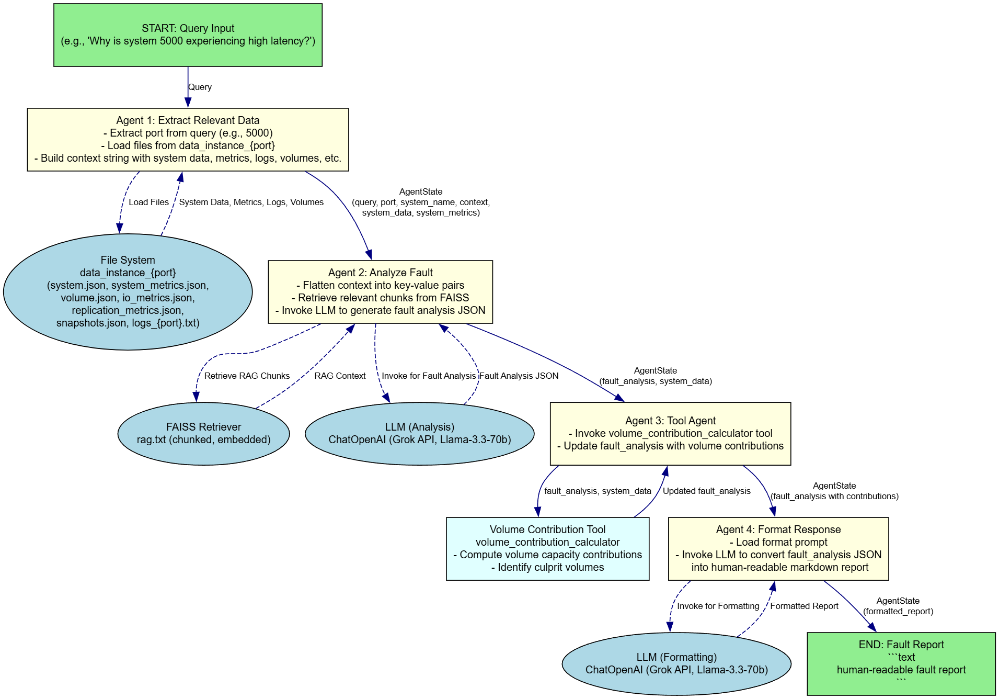

# Workflow

This folder contains workflow diagrams and detailed explanations of the LLM-powered analysis process.

## Contents

- `llm_explanation.md` — Detailed breakdown of the agent workflow.
- `llm_workflow_diagram.png` — Visual diagram of the workflow.

## Usage

- Refer to these files for onboarding, debugging, or extending the workflow.
- Update diagrams and explanations as the workflow evolves.

## Example

 